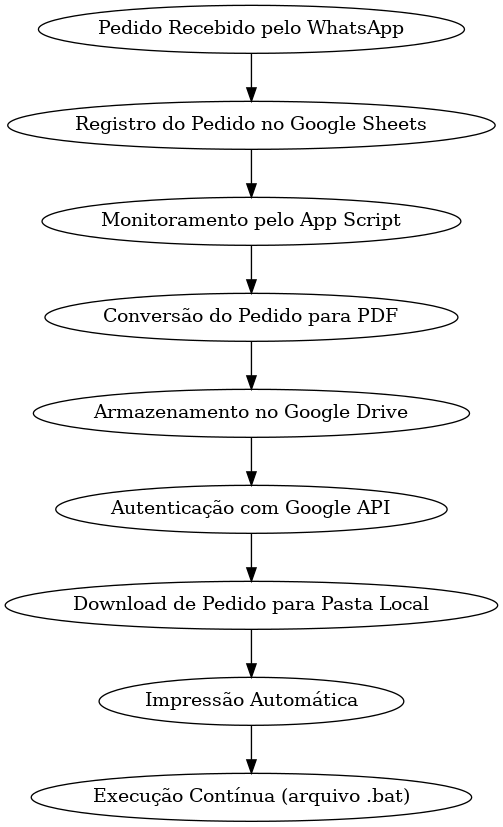

# Impressão automatizada de pedidos

## Descrição

Este projeto foi desenvolvido para atender a uma necessidade específica de um cliente, visando otimizar seu fluxo de trabalho. O cliente é uma pizzaria que utiliza automação de pedidos pelo WhatsApp, por meio de um bot configurado com a ferramenta BotConversa. Cada pedido gerado pelo bot é registrado automaticamente em uma planilha no Google Sheets, com cada linha representando um pedido detalhado.

No entanto, o BotConversa não oferecia uma funcionalidade essencial para o cliente: a impressão automática dos pedidos. Era esse o problema que precisava ser solucionado.

### Problema: 
O cliente necessitava de uma forma de gerar e imprimir automaticamente os pedidos registrados na planilha em sua impressora térmica, sem que os atendentes precisassem fazer isso manualmente.

### Solução: 

A solução implementada foi um script em Google App Script, configurado para monitorar a planilha. Sempre que um novo pedido é adicionado, o script é acionado e converte o pedido para um arquivo PDF, que é então armazenado em uma pasta específica no Google Drive.

Em seguida, configurei uma integração com a API do Google Drive, utilizando PHP junto com uma biblioteca do Composer para facilitar o acesso às APIs REST do Google. Foram gerados e configurados os arquivos de credenciais (token.json e credentials.json) necessários para autenticação e autorização.

O sistema em PHP foi programado para acessar a pasta no Drive e verificar quais arquivos ainda não haviam sido baixados para a máquina local. Ao identificar um novo arquivo, ele o baixa e realiza a impressão automaticamente. O nome da impressora foi especificado no código para que o sistema a reconheça, sendo necessário que o nome da impressora esteja configurado corretamente nas configurações do sistema.

Por fim, para garantir a execução automática do processo, criei um arquivo .bat que executa o script PHP em um loop a cada 30 segundos. Esse arquivo .bat foi adicionado à pasta de Inicialização do Windows, garantindo que seja executado automaticamente sempre que a máquina for ligada.

## Fluxo de trabalho

## Como instalar e utilizar

#clone esse repositório
git clone https://github.com/luizamaro11/imprimir-pedido.git

#acesse a página do projeto no terminal
cd imprimir-pedido

#Instale as dependencias do composer
composer install

#Configurar o Google Drive API
Configure o Google Drive API para acessar uma pasta específica. Siga estas etapas:

1. Crie um projeto no Google Cloud Console.
2. Ative a Google Drive API para o projeto.
3. Configure a autenticação OAuth 2.0 e baixe o arquivo credentials.json.

#Configure a impressora no windows
1. Configurações > Dispositivos > Impressora e Scanners
2. Selecione a impressora e clique em 'gerenciar'
3. Clique em 'Propriedades da impressora' > 'Compartilhamento'
4. Marque Compartilhar esta impressora e dê um nome de compartilhamento.

#Adicione o arquivo .bat ao inicializador do windows
1. Copie o arquivo run_script.bat
2. Entre no gerenciador de tarefas
3. Click na aba Inicializar e click com o botão direito do mouse
4. Selecione a opção: abrir local do arquivo
5. Cole o arquivo na pasta.

## Autor

[ Luiz Henrique](https://github.com/luizamaro11)
